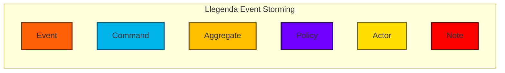
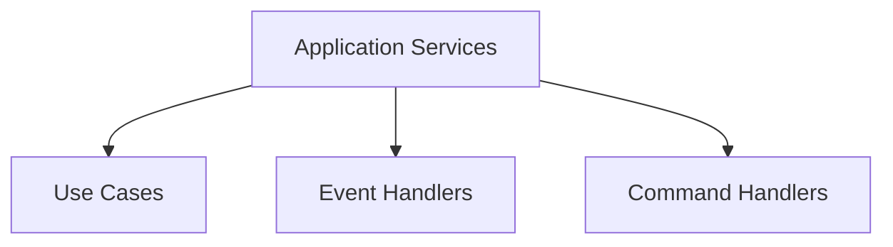

Al començar un projecte complex com el que estem abordant, és essencial tenir el màxim context possible, però tambe partir de zero en el coneixement del domini i anar explorant amb l'ajuda dels *domain experts*. Aquesta activitat no només ajuda a l'equip tècnic a alinear-se amb els objectius del negoci, sinó que també ajudar a fer-se un mapa global establint les bases per prendre millors decisions al llarg del cicle de vida del producte.

Per entendre com funcionava l'aplicatiu existent, identificar els diferents procesos que s'executaven i saber com estaven representats al codi així com establir un llenguatge comú amb l'anterior equip i els usuaris actuals del aplicatiu vam realitzar unes primeres sessions que no van ser gaire fructíferes, fins al punt de valorar si podiem ferun traspàs més traumàtic prescindint d'aquestes i espavilar-nos pel nostre compte.

## EventStorming

Al incorporar-me com a *tech lead* des d'un principi vaig tenir clar que degut a la complexitat del projecte i si volia que l'equip tingués un *ownership* real del producte haviem de donar un enfocament *domain-driven* tant al projecte com a l'equip.

Això ens permetria moure el domini al centre de la narrativa, d'aquesta manera alineariem tot l'equip al voltant d'un llenguatge comú (*ubiquitous language*) que ens facilitaria la comunicació i ens permetria fer un mapa de l'estat actual de l'aplicació.

Així que un cop format aquest equip inicial vam començar a prepar sessions d'[EventStorming](https://www.eventstorming.com/). Aquesta metodologia visual ens va ajudar a descompondre els processos clau del sistema i identificar esdeveniments i entitats de domini rellevants.

Per a facilitar les sessions vam utilitzar una [plantilla de Miro](https://miro.com/miroverse/event-storming/) que  ja porta una mica de guía i llegenda de les referències claus que s'han de tenir en compte per enfocar una sessió d'aquest tipus. Si voleu fer una sessió vindria bé que els participans tinguin un mínim de noció d'alguns conceptes amb els que hauran de trrballar, ja sigui fent fer una mica de *prework* o fer una explicació al iniciar la sessió.



Per maximitzar l'efectivitat de les sessions vam desenvolupar un procés estructurat en diverses fases:

1. **Exploració d'Events de Domini** (Foto inicial)
    - Identificar els esdeveniments clau del sistema
    - Ordenar-los cronològicament
    - Detectar gaps i dependències
    - Validar la seqüència amb els experts

2. **Refinament i Anàlisi**

    - Afegir notes explicatives
    - Documentar dubtes i preguntes
    - Entrar més en detall en cada esdeveniment
    - Marcar punts de decisió crítics

3. **Modelatge del Domini**

    - Identificar agregats (*aggregates*) i les seves fronteres
    - Definir actors i els seus rols
    - Establir comandes (*commands*) que inicien processos
    - Documentar polítiques (*policies*) i regles de negoci
    - Identificar triggers externs i interns de cada esdeveniment

4. **Documentació i Validació**

    - Netejar i organitzar la informació recollida
    - Establir relacions clares entre elements
    - Validar el model amb tots els stakeholders
    - Crear documentació de referència

L'*EventStorming* no només ens va servir per entendre el domini, sinó que també va ser el punt de partida per aplicar els principis de *Domain-Driven Design (DDD)* tant a nivell estratègic com tàctic.

### Domain-Driven Design Estratègic

Un dels punts més importants en la fase inicial del projecte va ser decidir com estructurar el domini a nivell estratègic. La complexitat del sistema, combinada amb la necessitat d'alinear els objectius tècnics amb els del negoci, ens va portar a adoptar principis de Domain-Driven Design (DDD).

Durant aquest procés, una de les eines més útils va ser el *Context Mapping*. Tot i que treballàvem amb un monolit encara pendent de refactorització, vam invertir temps a identificar diversos *Bounded Contexts* dins del domini. A la pràctica, això volia dir que, tot i haver descrit i delimitat diversos contextos conceptuals, a nivell tècnic operàvem dins d’un únic *Bounded Context* amb un sol *Shared Kernel*. Aquesta realitat monolítica no ens va impedir aprofitar els beneficis d’aquesta anàlisi.

Encara que no aprofundíssim en el *Context Mapping* de manera exhaustiva, utilitzar aquestes tècniques en aquesta etapa va ser clau per assegurar que el projecte tingués un camí clar cap a una arquitectura orientada al domini. Aquest enfocament no només facilita el desenvolupament tècnic, sinó que també promou una millor col·laboració entre els equips tècnics i els de negoci.

#### Establint els Límits (*Bounded Contexts*)

Identificar els *Bounded Contexts* ens va permetre entendre millor com es relacionaven les diferents parts del sistema, tant entre si com amb els sistemes externs. Aquest exercici no només ens va ajudar a gestionar la complexitat de manera més eficient, sinó que també va establir una base clara per als passos evolutius posteriors del projecte. A mesura que el sistema evolucioni cap a una arquitectura més modular, aquestes decisions inicials serviran de guia per descompondre el monòlit en components més manejables i alineats amb els contextos definits

També ens va ajudar a entendre on havíem de dirigir els esforços de desenvolupament i quines parts del sistema podien ser simplificades, desacoblades o eliminades. Tècnicament, ens vam centrar especialment en la implementació de *Anti-Corruption Layers* (ACL), ja que ens permetien interactuar amb sistemes externs sense comprometre la integritat del nostre sistema.

En el nostre cas, inicialment vam identificar cinc grans contexts clarament diferenciats:

- Assignació de comandes
- Generació d'etiquetes
- Preparació de comandes
- Integració E-commerce
- Preparació de comandes massiu

Aquestes decisions no només han establert els fonaments per a una arquitectura sostenible, sinó que també han garantit que els processos de desenvolupament siguin més focalitzats i alineats amb les necessitats del negoci.

[](https://res.cloudinary.com/dufky4znh/image/upload/v1736502607/event-storming2_nlyn9s.png)

#### Llenguatge Ubic (*Ubiquitous language*)

Un altre aspecte fonamental va ser establir un llenguatge ubic (*ubiquitous language*) sòlid. Els avantatges d'establir aquest llenguatge són molt superiors a qualsevol sobresforç de traducció o al risc de malinterpretar conceptes. Els experts de domini (*Domain Experts*) i els programadors han de coŀlaborar activament per crear aquest llenguatge comú, que va més enllà d'un simple glossari de termes. Es tracta d'un recurs viu i dinàmic que connecta l'equip tècnic amb els experts del domini.

L'esforç en la seva implementació ha facilitat la comunicació, reduït malentesos i assegurat que el codi sigui una representació fidel del domini. Desenvolupar software no és només una qüestió tècnica; és una activitat basada en la comunicació i la coŀlaboració. Gràcies al llenguatge ubic, tots els membres de l'equip treballen alineats, cosa que resulta en solucions tècniques més eficients i que responen millor a les necessitats del negoci.

### *Domain-Driven Design* Tàctic

Un cop definit el marc estratègic, vam passar a implementar principis de DDD tàctic en el sistema. Això ens va permetre estructurar el codi de manera que reflectís la realitat del domini i fos més sostenible a llarg termini.

#### Entitats (*Entities*) i Objectes de Valor (*Value Objects*)

Les entitats (Entities) i els objectes de valor (Value Objects) són dos conceptes fonamentals en el Domain-Driven Design (DDD). Per entendre com funcionen, és important destacar les seves diferències i el paper que juguen dins del domini.

#### Entitats (*Entities*)

Les entitats són elements del domini que tenen una identitat única que perdura al llarg del temps, fins i tot si els seus atributs canvien. Aquesta identitat única és el que les distingeix d'altres elements del mateix tipus. A més, les entitats solen tenir un cicle de vida definit dins del sistema. Exemples d'entitats que vam identificar en el projecte són:

- Order: Representa una ordre de compra amb una identitat única i un estat associat.
- Product: Element del catàleg amb atributs com el codi SKU, preu i descripció.
- Carrier: Empresa encarregada de lliurar les comandes amb opcions de servei específiques.
- Shop: Identifica de quin e-commerce o plataforma ens ha arribat la comanda.
- Customer: Persona o entitat que realitza la comanda i rep el producte.

#### Objectes de Valor (Value Objects)

Els objectes de valor, en canvi, són elements del domini que no tenen identitat pròpia. El seu valor és el que els defineix, i per això, dos objectes de valor amb els mateixos atributs són considerats equivalents. Això els fa immutables i ideals per encapsular conceptes clau que poden aparèixer en diverses parts del domini. Alguns exemples d'objectes de valor en el projecte inclouen:

- ProductReference: Codi únic per identificar un producte.
- ProductEan13: Codi de barres EAN-13 associat a un producte.
- OrderReference: Identificador únic d'una comanda.
- Price: Amb moneda i valor precís.
- Weight: Amb unitats de mesura estandarditzades.
- ShippingNumber: Número d'identificació per seguiment.

Aquest enfocament ens ajuda a crear codi més comprensible i modular, ja que cada element del sistema té una responsabilitat clara i ben definida.

Exemple d'un objecte de valor:

```php
<?php
readonly class ProductEan13
{
    public string $value;

    public function __construct(
        string $value
    )
    {
        $pattern = '/^\d{13}$/';
        if (!preg_match($pattern, $value)) {
            throw new \Exception('Invalid product Ean13');
        }
        $this->value = $value;
    }
}
```

#### Serveis (Services)

En una aplicació complexa com la nostra, el concepte de Serveis juga un paper central en el manteniment d'un codi net i modular. Els serveis es classifiquen en diferents capes i tipus segons el seu propòsit i els patrons que implementen. Explorem l'estructura i els patrons que fem servir per organitzar i implementar serveis de manera efectiva.

##### Serveis de Domini

Els Serveis de Domini encapsulen lògica de negoci que no encaixa directament en cap entitat o valor específic. Són serveis que operen estrictament dins de les regles del domini i no tenen dependències amb components d'infraestructura.

```php
<?php
class CheapestCarrierGetter
{
    public function get(
        DeliveryOptionCarrierCollection $deliveryOptionCarriers,
        Weight                          $orderWeight,
        Country                         $country,
        PostalCode                      $postalCode,
        bool                            $isCashOnDelivery = false,
    ): Carrier {
        // Lògica per obtenir el transportista més econòmic
    }
}

```

##### Serveis d'Aplicació

Els Serveis d'Aplicació encapsulen i coordinen lògica que combina operacions de domini amb interaccions externes per implementar escenaris específics de negoci o aplicació. Aquests serveis centralitzen i simplifiquen la implementació d'operacions complexes, assegurant una separació clara entre el domini i la infraestructura. Els més coneguts són els casos d'ús (use cases) però en el nostre cas  també tindrem *Command Handlers* i *Event Handlers*.



Els Use Cases representen accions o processos específics que l'aplicació necessita realitzar per complir amb els requisits de negoci. Encapsulen la lògica necessària per executar operacions complexes, incloent-hi interaccions amb serveis de domini i infraestructura, mantenint el domini net i focalitzat. Podriem dir que la seva responsabilitat hauria de ser nomes la d'orquestrar entre aquestes dues capes, i deixant la responsabilitat cap al domini, com diu Vaughn Vernon *“Keep Application Services thin, using them only to coordinate tasks on the model.”*

Els *Command Handlers* són la porta d'entrada per a les modificacions en el domini. En rebre un *Command*, validen la petició, deleguen la lògica de negoci als agregats corresponents i, finalment, publiquen un esdeveniment que reflecteix el canvi produït en el sistema.

D'altra banda els *Event Handlers* actuen com a *listeners* a canvis en el sistema. Escolten esdeveniments i executen accions específiques en resposta, com ara enviar notificacions, actualitzar altres agregats o integrar-se amb sistemes externs. Aquesta reacció desacoblada permet construir sistemes més flexibles i escalables. Ampliaré els detalls i conceptes en pròximes entrades quan parlem sobre l'evolució de l'aplicatiu com a una arquitectura basada en events i sistemes de cues(Event-Driven Architecture, EDA).

```php
<?php
readonly class NotifyShopOnOrderShipped implements EventHandlerInterface
{
    public function __construct(
        private OrderRepositoryInterface    $orderRepository,
        private ExternalOrderUpdaterFactory $externalOrderUpdaterFactory,
        private LoggerInterface             $logger
    ) {}

    public function __invoke(OrderShippedDomainEvent $event): void
    {
        // Lògica per notificar la botiga quan una comanda ha estat enviada
        $order = $this->orderRepository->findById($event->getOrderId());
        if (!$order) {
            $this->logger->error("Comanda no trobada", ['orderId' => $event->getOrderId()]);
            return;
        }

        $updater = $this->externalOrderUpdaterFactory->create($order);
        $updater->updateStatus('shipped');

        $this->logger->info("Notificació d'enviament completada", ['orderId' => $order->getId()]);
    }
}

```

##### Serveis d'Infraestructura

Els Serveis d'Infraestructura implementen operacions que depenen de components externs com bases de dades, sistemes de fitxers o serveis de tercers. Sovint actuen com adaptadors per garantir que el domini es mantingui agnòstic a la implementació concreta.

```php
<?php
class MonologLogger implements LoggerInterface
{
    private $logger;

    public function __construct(Logger $logger)
    {
        $this->logger = $logger;
    }

    public function info(string $message, array $context = []): void
    {
        $this->logger->info($message, $context);
    }

    public function warning(string $message, array $context = []): void
    {
        $this->logger->warning($message, $context);
    }

    public function critical(string $message, array $context = []): void
    {
        $this->logger->critical($message, $context);
    }

    public function error(string $message, array $context = []): void
    {
        $this->logger->error($message, $context);
    }
}
```

##### Classificació dels serveis

Com hem vist, els serveis ens serveixen per desacoblar i descomposar lògica de la nostra aplicació d'una forma més granular i independent., aquí us deixo una classificació de serveis comuns que hem identificat en els nostre projecte, agrupant-los segons la seva funció principal i associant-los a patrons de disseny coneguts. Aquesta classificació ens permet tenir una visió més estructurada de la nostra arquitectura i facilita la presa de decisions a l'hora de dissenyar noves funcionalitats.

| Tipus de Servei  | Descripció                                                                | Patró       | Exemple                                                 |
| ---------------- | ------------------------------------------------------------------------- | ----------- | ------------------------------------------------------- |
| **Transformers** | Converteixen dades entre diferents formats o representacions.             | *Adapter*   | Convertir respostes d'API externes en models de domini. |
| **Builders**     | Construeixen objectes complexos pas a pas.                                | *Builder*   | Crear un objecte `Order`.                               |
| **Factories**    | Creen objectes de domini assegurant que compleixen regles i restriccions. | *Factory*   | Crear instàncies de `Product`.                          |
| **Presenters**   | Donen format a les dades per a la interfície d'usuari o respostes d'API.  | *Decorator* | Enriquir dades per mostrar-les a l'usuari.              |
| **Notifiers**    | Envien notificacions (correu, SMS, etc.).                                 | *Observer*  | Notificar l'usuari de canvis importants.                |
| **Validators**   | Asseguren que objectes compleixin regles de negoci.                       | *Strategy*  | Validar sol·licituds d'usuari o formularis.             |
| **Clients**      | Interactuen amb aplicacions o serveis externs.                            | *Proxy*     | Consumir APIs externes per obtenir informació.          |

---

Tots aquests conceptes de domini són només una petita mostra de tot el que vam arribar a fer modelat. Evidentment, tampoc ho vam fer de cop ni vam encertar tot a la primera: hi ha moltes parts que encara van quedar pendents de reestructurar, conceptes que no vam acabar d'aclarir del tot i repositoris que sabíem que no tenien sentit, però que havíem de mantenir per funcionalitats, però que haviem d'acabar d'eliminar.

Però amb aquesta feina feta inicialment, es va permetre que tot l'equip participés en aquest procés i tingués un compromís (*commitment*) per tot el que estàvem construint.

Per aprofundir en aquests conceptes de DDD i com aplicar-los, recomano llegir els llibres següents:

- "Domain-Driven Design: Tackling Complexity in the Heart of Software" d'Eric Evans: L'obra fundacional sobre DDD que introdueix i explica en profunditat els conceptes d'entitats i objectes de valor.
- "Implementing Domain-Driven Design" de Vaughn Vernon: Un llibre pràctic que ofereix exemples concrets de com implementar DDD en projectes reals.
- "Domain-Driven Design in PHP" de Carlos Buenosvinos, Christian Soronellas & Keyvan Akbary

## Construïnt equip

El procés d'adopció de DDD va anar paraŀlel a la formació i evolució de l'equip. Aquí és on vull parlar del model d'etapes de Tuckman (1965): *Forming, Storming, Norming, Performing*, ja que considero que l'evolució de l'equip va seguir aquesta seqüència i això ens va ajudar d'una banda a alinear les nostres pràctiques tècniques i d'altra a desenvolupar una cultura de col·laboració i confiança en l'equip. Tal com descriu Tuckman (1965), comprendre i abraçar aquestes etapes és clau per construir equips d'alt rendiment. La referència original pot trobar-se al seu treball: Tuckman, B. W. (1965). Developmental sequence in small groups. Psychological Bulletin, 63(6), 384–399.

Segons aquest model, els equips passen per quatre fases distintives per arribar al màxim rendiment. Durant la fase inicial (*Forming*), els membres de l'equip s'introdueixen i defineixen objectius generals. A la fase de *Storming*, emergeixen conflictes mentre es comencen a establir els rols. Amb el temps, en la fase de *Norming*, els equips aconsegueixen una dinàmica de treball cohesionada, que culmina en *Performing*, on es treballa de manera eficient cap als objectius comuns.

### Formació (*Forming*)

L'equip es va formar inicialment amb dos desenvolupadors, que van començar revisant el projecte i documentant el seu funcionament, mentre altres membres tancaven els seus respectius projectes per incorporar-se en aquest. Per la meva banda em vaig incorporar com a *tech lead* i vaig començar a repasar la nova documentació que s'havia generat i establir establir les bases tècniques i organitzatives del projecte i l'equip en quant a processos, estàndards i eines.

### Tempesta (*Storming*)

No podríem dir que hi va haver grans desavinences dins l'equip, però sí que vam veure la necessitat de "regular" certs aspectes per tal d'anar tots més alineats. Es va fer més palesa aquesta necessitat quan vam incorporar dues persones més a l'equip i el *roadmap* començava a prendre forma. Això va fer que ens plantegéssim com volíem treballar, comunicar-nos i sobretot com fer visibles totes aquestes decisions i coneixements en un projecte que estava en constant evolució.

Així que rapidament vam passar a la fase de *Norming* per establir les bases de com volíem treballar i com volíem organitzar-nos.

### Estandarització (*Norming*)

Durant aquest període vam acordar diversos aspectes per facilitar el treball en equip:

- Team Agreements: Normes per al treball en equip i la comunicació com la definició de cerimonies, horaris de reunions, canals de comunicació, etc.
- Coding Standards: Guies per escriure codi net i mantenible seguint les bases de DDD, Arquitectura Hexagonal i principis SOLID.
- Procés de Desenvolupament: Definició de les eines, processos i pràctiques a seguir per a mantenir un flux de treball eficient, amb l'objectiu de millorar la qualitat del codi i la productivitat de l'equip fomentant una cultura de col·laboració i aprenentatge.
- Límits de WIP (Work In Progress): Per garantir un flux sostenible de treball. Té un capitol a part per reforçar la seva importància, com a part de la metodologia Lean a la que ens vam acostar.
- Deployments: Regles per a desplegaments controlats i fiables, incloent les limitacions horàries i els procediments de rollback.
- Deute Tècnic: Definició i gestió del deute tècnic acumulat així com facilitar un marc per identifcar-lo i prioritzar-lo si s'escau
- ADR: Registre i justificació de decisions arquitectòniques per garantir la coherència i la traçabilitat de les decisions preses.

### Rendiment (*Performing*)

Amb tota la feina feta en les etapes anteriors, havíem creat un marc de treball que ens permetia centrar-nos en el desenvolupament del producte de manera eficient i sense preocupacions, més enllà de les de prioritzar aquelles iniciatives que aportessin més valor en el context de cada moment. Això va permetre que l'equip es centressi en la implementació de funcionalitats de negoci a la vegada que es millorava la qualitat del codi, ens formavem i manteniem la documentació viva.

## Documentació

Tot aquest esforç no tenia sentit si no es feia d'alguna manera visible. Ho vam documentar perquè estigués accessible en qualsevol moment i fàcil d'actualitzar. Utilitzàvem GitLab per gestionar el codi del projecte, així que vam activar la funcionalitat de [GitLab Pages](https://docs.gitlab.com/ee/user/project/pages/) i després d'una mica d'investigació vam utilitzar Jekyll amb el tema [Just the Docs](https://just-the-docs.com/).

Per organitzar la informació, vam basar-nos en el model [Diátaxis](https://diataxis.fr/):

- **Tutorials**: Guies per a funcionalitats del aplicatiu, destinades principalment a l'usuari final (exemple: Configuració de Transportistes).
- **Guies**: Instruccions pràctiques i solucions de problemes específics, tant per a usuaris finals com desenvolupadors (exemple: Com instal·lar l'aplicació).
- **Explicacions**: Coneixements en profunditat dels processos d'equip i estàndards (exemple: Team agreements i estàndards de codi).
- **Referències**: Informació detallada per a desenvolupadors (exemple: ADRs, arquitectura del aplicatiu).

Un següent pas que no vam arribar a implementar del tot va ser automatitzar la documentació tècnica mitjançant [Event Catalog](https://www.eventcatalog.dev/) i [AsyncAPI](https://www.asyncapi.com/).

